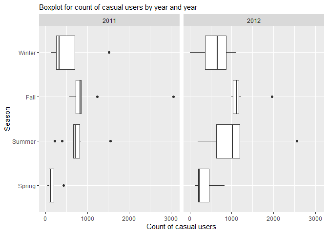

ST 558 Project 2
================
Yu Bai & Lee Pixton
7/11/2021

``` r
#clear environment
#rm(list = ls())

#not show warning message
options(warn = -1)

#set random seed
set.seed(123)
```

``` r
knitr::opts_chunk$set(tidy.opts = list(width.cutoff = 50), tidy = TRUE)
library(rmarkdown)
library(dplyr)
```

    ## 
    ## Attaching package: 'dplyr'

    ## The following objects are masked from 'package:stats':
    ## 
    ##     filter, lag

    ## The following objects are masked from 'package:base':
    ## 
    ##     intersect, setdiff, setequal, union

``` r
library(tidyverse)
```

    ## -- Attaching packages --------------------------------------- tidyverse 1.3.1 --

    ## v ggplot2 3.3.3     v purrr   0.3.4
    ## v tibble  3.1.2     v stringr 1.4.0
    ## v tidyr   1.1.3     v forcats 0.5.1
    ## v readr   1.4.0

    ## -- Conflicts ------------------------------------------ tidyverse_conflicts() --
    ## x dplyr::filter() masks stats::filter()
    ## x dplyr::lag()    masks stats::lag()

``` r
library(knitr)
library(readr)
library(parallel)
library(MuMIn)
library(modelr)
library(caret)
```

    ## Loading required package: lattice

    ## 
    ## Attaching package: 'caret'

    ## The following object is masked from 'package:purrr':
    ## 
    ##     lift

``` r
library(formatR)  
library(randomForest)
```

    ## randomForest 4.6-14

    ## Type rfNews() to see new features/changes/bug fixes.

    ## 
    ## Attaching package: 'randomForest'

    ## The following object is masked from 'package:MuMIn':
    ## 
    ##     importance

    ## The following object is masked from 'package:ggplot2':
    ## 
    ##     margin

    ## The following object is masked from 'package:dplyr':
    ## 
    ##     combine

# Introduction

People are constantly finding new and innovative ways to help people get
around town, especially in large cities. One of these more recent
methods is through bike sharing. Through technology and smart phones,
the whole process of renting a bike, from membership, rental and return
has become automatic. These systems allow users to easily rent a bike
from a location nearby and return it back to another location, without
having to return to the pick up spot.  
The data we will be exploring contains the hourly and daily counts of
bike rentals between 2011 and 2012 in the Capital bikeshare system in
Washington, DC. We will be focused on predicting the number of casual
users, and be exploring the following variables:

-   `casual` - count of casual users
-   `season` - winter, spring, summer or fall
-   `workingday` - whether the day is a work day (not a holiday or
    weekend)
-   `weathersit` - weather situation (clear, misty, light precipitation,
    heavy precipitation)
-   `atemp` - Temperature feel in degrees Celsius
-   `hum` - humidity level

We will use both linear regression and ensemble learning methods to
predict the casual user count with the above variables.

# Data

## Read csv data

First we read in the data from a csv file.

``` r
getwd()
```

    ## [1] "D:/Documents/NCSU/ST558/ST558_Project-2"

``` r
data <- read_csv(file = "./Bike-Sharing-Dataset/day.csv",
    col_names = TRUE)
```

    ## 
    ## -- Column specification --------------------------------------------------------
    ## cols(
    ##   instant = col_double(),
    ##   dteday = col_date(format = ""),
    ##   season = col_double(),
    ##   yr = col_double(),
    ##   mnth = col_double(),
    ##   holiday = col_double(),
    ##   weekday = col_double(),
    ##   workingday = col_double(),
    ##   weathersit = col_double(),
    ##   temp = col_double(),
    ##   atemp = col_double(),
    ##   hum = col_double(),
    ##   windspeed = col_double(),
    ##   casual = col_double(),
    ##   registered = col_double(),
    ##   cnt = col_double()
    ## )

``` r
# Select Monday
p2 <- data %>%
    filter(weekday == params$day)
```

## Split data into train data (70%) and test data (30%)

Next, we set the categorical variables to factors and create a test and
train set.

``` r
p2$season <- factor(p2$season, levels = c(1, 2, 3,
    4), labels = c("Spring", "Summer", "Fall", "Winter"))
p2$yr <- factor(p2$yr, levels = c(0, 1), labels = c("2011",
    "2012"))
p2$holiday <- factor(p2$holiday, levels = c(0, 1),
    labels = c("Not holiday", "Holiday"))
p2$weekday <- factor(p2$weekday, levels = c(0, 1, 2,
    3, 4, 5, 6), labels = c("Sunday", "Monday", "Tuesday",
    "Wednesday", "Thursday", "Friday", "Saturday"))
p2$workingday <- factor(p2$workingday, levels = c(0,
    1), labels = c("Not workingday", "Workingday"))
p2$weathersit <- factor(p2$weathersit, levels = c(1,
    2, 3, 4), labels = c("Clear", "Mist cloudy", "Light snow/rain",
    "Heavy rain/snow"))
p2$mnth <- factor(p2$mnth)

train <- sample(1:nrow(p2), size = nrow(p2) * 0.7)
test <- dplyr::setdiff(1:nrow(p2), train)
p2Train <- p2[train, ]
p2Test <- p2[test, ]
```

## Summarizations

``` r
### count of casual users by season
s1 <- p2Train %>%
    group_by(season) %>%
    summarize(avg_casual = mean(casual, na.rm = TRUE),
        sd_casual = sd(casual, na.rm = TRUE), min_casual = min(casual,
            na.rm = TRUE), max_casual = max(casual,
            na.rm = TRUE))

kable(s1, caption = "Count of casual users by season")
```

| season | avg\_casual | sd\_casual | min\_casual | max\_casual |
|:-------|------------:|-----------:|------------:|------------:|
| Spring |    260.5333 |   210.4973 |          42 |         838 |
| Summer |    864.4211 |   535.6975 |         195 |        2557 |
| Fall   |   1126.1000 |   542.6129 |         568 |        3065 |
| Winter |    581.7368 |   380.6601 |           2 |        1514 |

Count of casual users by season

``` r
## Graph Boxplot for count of casual users by
## season
g <- ggplot(data = p2Train, aes(x = casual, y = season))
g + geom_boxplot() + labs(subtitle = "Boxplot for count of casual users by season",
    x = "Count of casual users", y = "Season") + guides(fill = guide_legend(title = NULL))
```

<!-- -->

``` r
### count of casual users by year
s2 <- p2Train %>%
    group_by(yr) %>%
    summarize(avg_casual = mean(casual, na.rm = TRUE),
        sd_casual = sd(casual, na.rm = TRUE), min_casual = min(casual,
            na.rm = TRUE), max_casual = max(casual,
            na.rm = TRUE))
kable(s2, caption = "Count of casual users by year")
```

| yr   | avg\_casual | sd\_casual | min\_casual | max\_casual |
|:-----|------------:|-----------:|------------:|------------:|
| 2011 |    655.4286 |   564.0132 |          42 |        3065 |
| 2012 |    814.9211 |   517.4945 |           2 |        2557 |

Count of casual users by year

``` r
## Graph Boxplot for count of casual users by
## year
g <- ggplot(data = p2Train, aes(x = casual, y = yr))
g + geom_boxplot() + labs(subtitle = "Boxplot for count of casual users by year",
    x = "Count of casual users", y = "Year") + guides(fill = guide_legend(title = NULL))
```

<!-- -->

``` r
### count of casual users by year and season
s4 <- p2Train %>%
    group_by(yr, season) %>%
    summarize(avg_casual = mean(casual, na.rm = TRUE),
        sd_casual = sd(casual, na.rm = TRUE), min_casual = min(casual,
            na.rm = TRUE), max_casual = max(casual,
            na.rm = TRUE))
```

    ## `summarise()` has grouped output by 'yr'. You can override using the `.groups` argument.

``` r
kable(s4, caption = "Count of casual users by year and season")
```

| yr   | season | avg\_casual | sd\_casual | min\_casual | max\_casual |
|:-----|:-------|------------:|-----------:|------------:|------------:|
| 2011 | Spring |    166.0000 |   131.2872 |          42 |         430 |
| 2011 | Summer |    741.1000 |   345.2038 |         222 |        1549 |
| 2011 | Fall   |   1061.2222 |   773.6355 |         568 |        3065 |
| 2011 | Winter |    535.1111 |   431.4633 |         143 |        1514 |
| 2012 | Spring |    343.2500 |   238.9314 |         126 |         838 |
| 2012 | Summer |   1001.4444 |   686.6533 |         195 |        2557 |
| 2012 | Fall   |   1179.1818 |   271.5094 |         998 |        1965 |
| 2012 | Winter |    623.7000 |   346.6952 |           2 |        1097 |

Count of casual users by year and season

``` r
# Barplot for count of casual users by year and
# season
g <- ggplot(data = p2Train, aes(x = casual, y = season))
g + geom_boxplot() + labs(subtitle = "Boxplot for count of casual users by year and year",
    x = "Count of casual users", y = "Season") + guides(fill = guide_legend(title = NULL)) +
    facet_wrap(~yr)
```

<!-- -->

``` r
# Graph: temperature feel and count of casual
# users

g <- ggplot(data = p2Train, aes(x = atemp, y = casual))
g + geom_point(aes(x = temp, y = casual), size = 3) +
    geom_smooth(data = p2Train, formula = y ~ x, method = lm,
        col = "Green") + labs(subtitle = "Temperature Feel and count of casual users",
    x = "Temperature Feel", y = "Count of casual users") +
    guides(fill = guide_legend(title = NULL))
```

<!-- -->

``` r
# Graph: humidity and count of casual users

g <- ggplot(data = p2Train, aes(x = hum, y = casual))
g + geom_point(aes(x = hum, y = casual), size = 3) +
    geom_smooth(data = p2Train, formula = y ~ x, method = lm,
        col = "Green") + labs(subtitle = "Humidity and count of casual users",
    x = "Normalized humidity", y = "Count of casual users") +
    guides(fill = guide_legend(title = NULL))
```

<!-- -->

``` r
### count of casual users by working day and
### season
s5 <- p2Train %>%
    group_by(workingday) %>%
    summarize(avg = mean(casual, na.rm = TRUE), sd = sd(casual,
        na.rm = TRUE), min = min(casual, na.rm = TRUE),
        max = max(casual, na.rm = TRUE))

kable(s5, caption = "Casual Users by Working Day")
```

| workingday     |       avg |       sd | min |  max |
|:---------------|----------:|---------:|----:|-----:|
| Not workingday | 1188.7857 | 886.3093 | 195 | 3065 |
| Workingday     |  631.5932 | 358.7059 |   2 | 1233 |

Casual Users by Working Day

``` r
# Scatterplot for casual by workingday and season
g1 <- ggplot(data = p2Train, aes(x = casual, y = workingday,
    group = season))
g1 + geom_point(aes(color = season)) + labs(title = "Count of Casual Users by Working Day and Season",
    x = "Count of casual users", y = "Working Day")
```

<!-- -->

``` r
### count of casual users by year
s6 <- p2Train %>%
    group_by(weathersit) %>%
    summarize(avg = mean(casual, na.rm = TRUE), sd = sd(casual,
        na.rm = TRUE), min = min(casual, na.rm = TRUE),
        max = max(casual, na.rm = TRUE))
kable(s6, caption = "Casual Users by Weather Situation")
```

| weathersit      |      avg |       sd | min |  max |
|:----------------|---------:|---------:|----:|-----:|
| Clear           | 777.8409 | 515.2536 |  86 | 2557 |
| Mist cloudy     | 720.7407 | 584.5461 |  42 | 3065 |
| Light snow/rain | 111.0000 | 154.1493 |   2 |  220 |

Casual Users by Weather Situation

``` r
### count of casual users by year
s7 <- p2Train %>%
    group_by(season) %>%
    summarize(count = sum(casual, na.rm = TRUE))
kable(s7, caption = "Count of Casual Users by Season")
```

| season | count |
|:-------|------:|
| Spring |  3908 |
| Summer | 16424 |
| Fall   | 22522 |
| Winter | 11053 |

Count of Casual Users by Season

``` r
# Count of casual users by weather and season
g2 <- ggplot(p2Train, aes(x = season))
g2 + geom_bar(aes(fill = casual, position = "dodge",
    color = season), fill = "white") + labs(title = "Count of Casual Users by Season and Weather",
    y = "Count of Casual Users", x = "Season") + theme(legend.title = element_blank(),
    axis.text.x = element_blank()) + facet_wrap(p2Train$weathersit)
```

<!-- -->

``` r
# Graph: humidity and count of casual users

g3 <- ggplot(p2Train, aes(x = atemp, y = hum))
g3 + geom_point(aes(size = casual, color = season)) +
    labs(title = "Casual Users by Temperature Feel and Humidty",
        x = "Temperature Feel", y = "Humidty") + guides(fill = guide_legend(title = NULL))
```

<!-- -->

## Modeling

Linear regression is to estimate the association between a response
variable and one or more predictors by using a linear approach. Four
models are built for the analysis. The first one is a linear model,
which includes 5 predictors (season, workingday, weathersit, atemp, and
hum). The second one is a random forest model. The third one is still a
linear model, which including 4 predictors (season, workingday,
weathersit, and atemp). The fourth one is a boosted tree model.

``` r
# Model 1: Linear model with all 5 predictor
# variables
f_m1 <- as.formula("casual~season+workingday+weathersit+atemp+hum")

fit_m1 <- train(f_m1, data = p2Train, method = "lm",
    preProcess = c("center", "scale"), trControl = trainControl(method = "cv",
        number = 10))
```

Random forests are a learning approach for classification and regression
problems to build a predictive model. This model is made of many
decision trees.

``` r
# Define trainControl
trctrl <- trainControl(method = "repeatedcv", number = 10,
    repeats = 3)

# Model 2: Ensemble tree model (Random forest)
fit_m2 <- train(f_m1, data = p2Train, method = "rf",
    trControl = trctrl, preProcess = c("center", "scale"),
    tuneGrid = data.frame(mtry = 1))
```

``` r
# Model 3: Linear model after dropping humidity
# from the first model
fit_m3 <- train(casual ~ season + workingday + weathersit +
    atemp, data = p2Train, method = "lm", preProcess = c("center",
    "scale"), trControl = trainControl(method = "cv",
    number = 10))
```

Boosting tree models is a general approach that consists of growing the
trees sequentially. This means that each tree is based off of the
previous one, and predictions are updated along the way. In essence, we
are using several weaker tree models sequentially in order to create a
strong tree model. The errors of previous models are minimized and the
next model is then “boosted” to ideally improve the accuracy of
predictions and reduce error.

``` r
# Model 4: Ensemble tree model (boosted tree)
gbmGrid <- expand.grid(interaction.depth = 4, n.trees = 1000,
    shrinkage = 0.1, n.minobsinnode = 2)

fit_m4 <- train(casual ~ season + workingday + weathersit +
    atemp + hum, data = p2Train, method = "gbm", trControl = trctrl,
    preProcess = c("center", "scale"), verbose = FALSE,
    tuneGrid = gbmGrid)
```

## Model comparison

``` r
result <- as.matrix(t(data.frame(RMSE = c(fit_m1$results[[2]],
    fit_m2$results[[2]], fit_m3$results[[2]], fit_m4$results[[5]]),
    Rsquared = c(fit_m1$results[[3]], fit_m2$results[[3]],
        fit_m3$results[[3]], fit_m4$results[[6]]),
    MAE = c(fit_m1$results[[4]], fit_m2$results[[4]],
        fit_m3$results[[4]], fit_m4$results[[7]]))))

colnames(result) <- c("Model1", "Model2", "Model3",
    "Model4")

kable(result)
```

|          |      Model1 |     Model2 |      Model3 |      Model4 |
|:---------|------------:|-----------:|------------:|------------:|
| RMSE     | 316.8653757 | 395.516004 | 305.5981483 | 278.6471616 |
| Rsquared |   0.6990728 |   0.662069 |   0.6927899 |   0.7978239 |
| MAE      | 236.4359667 | 301.865135 | 229.0790008 | 204.2917337 |

## Model selection

``` r
RMSE_min <- min(fit_m1$results[[2]], fit_m2$results[[2]],
    fit_m3$results[[2]], fit_m4$results[[5]])

if (fit_m1$results[[2]] == RMSE_min) {
    model <- 1
}
if (fit_m2$results[[2]] == RMSE_min) {
    model <- 2
}
if (fit_m3$results[[2]] == RMSE_min) {
    model <- 3
}
if (fit_m4$results[[5]] == RMSE_min) {
    model <- 4
}
```

The best model is the one with smallest RMSE. Based on the table above,
the best model is Model 4
