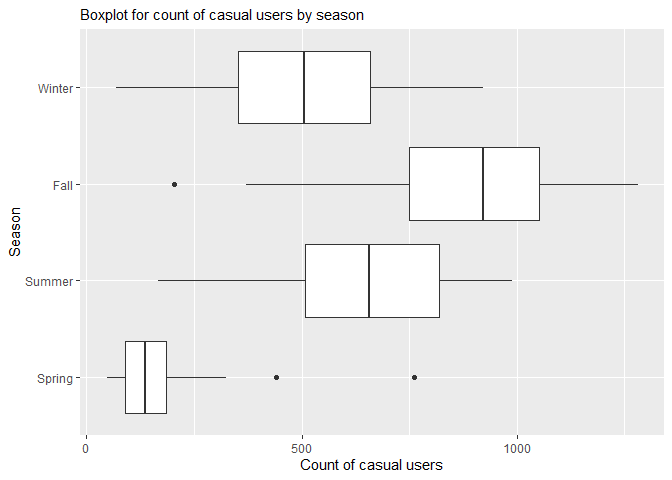
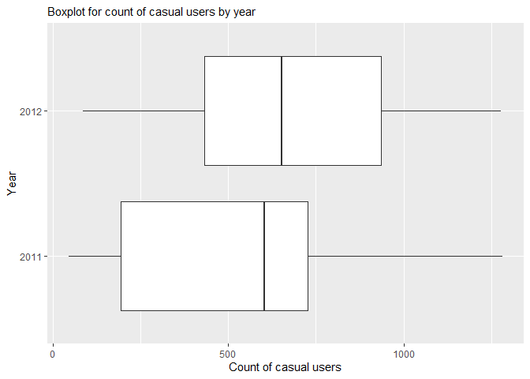
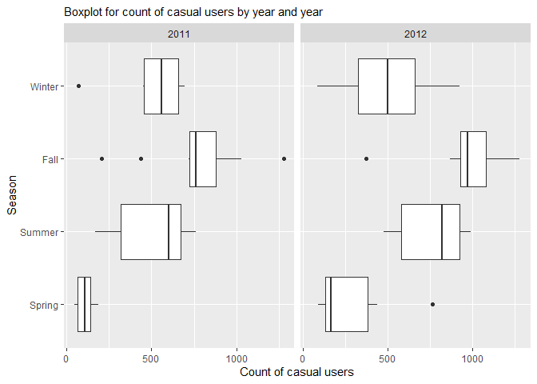
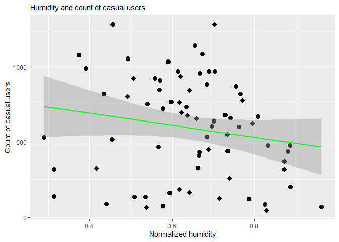
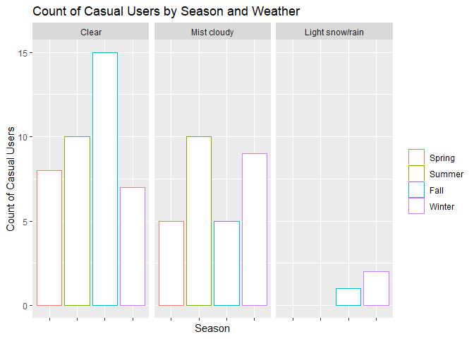
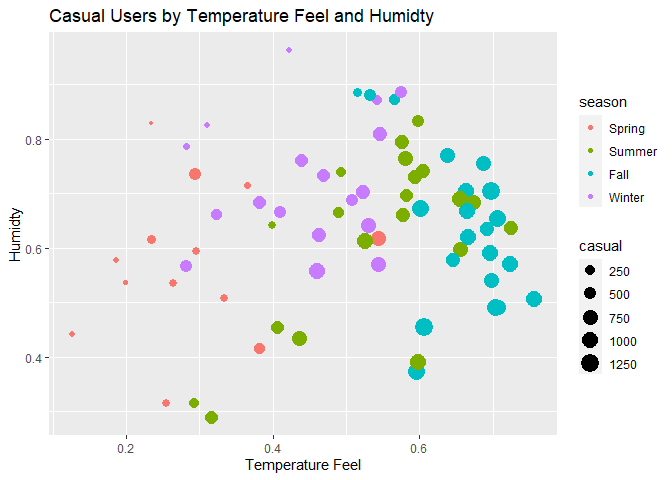

ST 558 Project 2
================
Yu Bai & Lee Pixton
7/11/2021

# Introduction

People are constantly finding new and innovative ways to help people get
around town, especially in large cities. One of these more recent
methods is through bike sharing. Through technology and smart phones,
the whole process of renting a bike, from membership, rental and return
has become automatic. These systems allow users to easily rent a bike
from a location nearby and return it back to another location, without
having to return to the pick up spot.  
The data we will be exploring contains the hourly and daily counts of
bike rentals between 2011 and 2012 in the Capital bikeshare system in
Washington, DC. We will be focused on predicting the number of casual
users, and be exploring the following variables:

-   `casual` - count of casual users
-   `season` - winter, spring, summer or fall
-   `workingday` - whether the day is a work day (not a holiday or
    weekend)
-   `weathersit` - weather situation (clear, misty, light precipitation,
    heavy precipitation)
-   `atemp` - Temperature feel in degrees Celsius
-   `hum` - humidity level

We will use both linear regression and ensemble learning methods to
predict the casual user count with the above variables.

## Packages

The packages that will be used in this analysis are below.

# Data

## Read csv data

First we read in the data from a csv file.

``` r
getwd()
```

    ## [1] "D:/Documents/NCSU/ST558/ST558_Project-2"

``` r
data <- read_csv(file = "./Bike-Sharing-Dataset/day.csv",
    col_names = TRUE)

# Select Monday
p2 <- data %>%
    filter(weekday == params$day)
```

## Split data into train data (70%) and test data (30%)

Next, we set the categorical variables to factors and create a test and
train set.

``` r
# Set categorical variables to factors
p2$season <- factor(p2$season, levels = c(1, 2, 3,
    4), labels = c("Spring", "Summer", "Fall", "Winter"))
p2$yr <- factor(p2$yr, levels = c(0, 1), labels = c("2011",
    "2012"))
p2$holiday <- factor(p2$holiday, levels = c(0, 1),
    labels = c("Not holiday", "Holiday"))
p2$weekday <- factor(p2$weekday, levels = c(0, 1, 2,
    3, 4, 5, 6), labels = c("Sunday", "Monday", "Tuesday",
    "Wednesday", "Thursday", "Friday", "Saturday"))
p2$workingday <- factor(p2$workingday, levels = c(0,
    1), labels = c("Not workingday", "Workingday"))
p2$weathersit <- factor(p2$weathersit, levels = c(1,
    2, 3, 4), labels = c("Clear", "Mist cloudy", "Light snow/rain",
    "Heavy rain/snow"))
p2$mnth <- factor(p2$mnth)

# Create train and test sets
train <- sample(1:nrow(p2), size = nrow(p2) * 0.7)
test <- dplyr::setdiff(1:nrow(p2), train)
p2Train <- p2[train, ]
p2Test <- p2[test, ]
```

## Summarizations

After reading in the data, we can now examine our training dataset. As
mentioned above, we will be specifically looking at the casual users of
bike sharing in this analysis.

### Casual Users by Season

``` r
### count of casual users by season
s1 <- p2Train %>%
    group_by(season) %>%
    summarize(avg_casual = mean(casual, na.rm = TRUE),
        sd_casual = sd(casual, na.rm = TRUE), min_casual = min(casual,
            na.rm = TRUE), max_casual = max(casual,
            na.rm = TRUE))

kable(s1, caption = "Count of casual users by season")
```

| season | avg\_casual | sd\_casual | min\_casual | max\_casual |
|:-------|------------:|-----------:|------------:|------------:|
| Spring |    206.7692 |   199.3770 |          47 |         762 |
| Summer |    638.6500 |   236.1804 |         167 |         989 |
| Fall   |    870.6190 |   276.4380 |         204 |        1281 |
| Winter |    502.1667 |   252.4392 |          69 |         922 |

Count of casual users by season

``` r
## Graph Boxplot for count of casual users by
## season
g1 <- ggplot(data = p2Train, aes(x = casual, y = season))
g1 + geom_boxplot() + labs(subtitle = "Boxplot for count of casual users by season",
    x = "Count of casual users", y = "Season") + guides(fill = guide_legend(title = NULL))
```

<!-- -->

### Casual Users by Year

``` r
### count of casual users by year
s2 <- p2Train %>%
    group_by(yr) %>%
    summarize(avg_casual = mean(casual, na.rm = TRUE),
        sd_casual = sd(casual, na.rm = TRUE), min_casual = min(casual,
            na.rm = TRUE), max_casual = max(casual,
            na.rm = TRUE))
kable(s2, caption = "Count of casual users by year")
```

| yr   | avg\_casual | sd\_casual | min\_casual | max\_casual |
|:-----|------------:|-----------:|------------:|------------:|
| 2011 |    509.9032 |   319.6630 |          47 |        1281 |
| 2012 |    657.9512 |   333.3155 |          87 |        1278 |

Count of casual users by year

``` r
## Graph Boxplot for count of casual users by
## year
g2 <- ggplot(data = p2Train, aes(x = casual, y = yr))
g2 + geom_boxplot() + labs(subtitle = "Boxplot for count of casual users by year",
    x = "Count of casual users", y = "Year") + guides(fill = guide_legend(title = NULL))
```

<!-- -->

### Casual Users by Both Year and Season

``` r
### count of casual users by year and season
s3 <- p2Train %>%
    group_by(yr, season) %>%
    summarize(avg_casual = mean(casual, na.rm = TRUE),
        sd_casual = sd(casual, na.rm = TRUE), min_casual = min(casual,
            na.rm = TRUE), max_casual = max(casual,
            na.rm = TRUE))
kable(s3, caption = "Count of casual users by year and season")
```

| yr   | season | avg\_casual | sd\_casual | min\_casual | max\_casual |
|:-----|:-------|------------:|-----------:|------------:|------------:|
| 2011 | Spring |    108.0000 |   54.33599 |          47 |         186 |
| 2011 | Summer |    502.8889 |  217.45830 |         167 |         763 |
| 2011 | Fall   |    763.9000 |  295.04066 |         204 |        1281 |
| 2011 | Winter |    499.0000 |  233.90938 |          69 |         695 |
| 2012 | Spring |    291.4286 |  242.74462 |          89 |         762 |
| 2012 | Summer |    749.7273 |  194.92003 |         477 |         989 |
| 2012 | Fall   |    967.6364 |  229.67206 |         371 |        1278 |
| 2012 | Winter |    503.7500 |  271.30597 |          87 |         922 |

Count of casual users by year and season

``` r
# Barplot for count of casual users by year and
# season
g3 <- ggplot(data = p2Train, aes(x = casual, y = season))
g3 + geom_boxplot() + labs(subtitle = "Boxplot for count of casual users by year and year",
    x = "Count of casual users", y = "Season") + guides(fill = guide_legend(title = NULL)) +
    facet_wrap(~yr)
```

<!-- -->

### Casual Users by Temperature Feel

``` r
# Graph: temperature feel and count of casual
# users

g4 <- ggplot(data = p2Train, aes(x = atemp, y = casual))
g4 + geom_point(aes(x = temp, y = casual), size = 3) +
    geom_smooth(data = p2Train, formula = y ~ x, method = lm,
        col = "Green") + labs(subtitle = "Temperature Feel and count of casual users",
    x = "Temperature Feel", y = "Count of casual users") +
    guides(fill = guide_legend(title = NULL))
```

<!-- -->

### Casual Users by Humidity

``` r
# Graph: humidity and count of casual users

g5 <- ggplot(data = p2Train, aes(x = hum, y = casual))
g5 + geom_point(aes(x = hum, y = casual), size = 3) +
    geom_smooth(data = p2Train, formula = y ~ x, method = lm,
        col = "Green") + labs(subtitle = "Humidity and count of casual users",
    x = "Normalized humidity", y = "Count of casual users") +
    guides(fill = guide_legend(title = NULL))
```

<!-- -->

### Casual Users by Working Day and Season

``` r
### count of casual users by working day and
### season
s4 <- p2Train %>%
    group_by(workingday) %>%
    summarize(avg = mean(casual, na.rm = TRUE), sd = sd(casual,
        na.rm = TRUE), min = min(casual, na.rm = TRUE),
        max = max(casual, na.rm = TRUE))

kable(s4, caption = "Casual Users by Working Day")
```

| workingday     |      avg |       sd | min |  max |
|:---------------|---------:|---------:|----:|-----:|
| Not workingday | 440.0000 |       NA | 440 |  440 |
| Workingday     | 596.3803 | 335.3528 |  47 | 1281 |

Casual Users by Working Day

``` r
# Scatterplot for casual by workingday and season
g6 <- ggplot(data = p2Train, aes(x = casual, y = workingday,
    group = season))
g6 + geom_point(aes(color = season)) + labs(title = "Count of Casual Users by Working Day and Season",
    x = "Count of casual users", y = "Working Day")
```

<!-- -->

### Casual Users by Weather

``` r
### count of casual users by weather situation
s5 <- p2Train %>%
    group_by(weathersit) %>%
    summarize(avg = mean(casual, na.rm = TRUE), sd = sd(casual,
        na.rm = TRUE), min = min(casual, na.rm = TRUE),
        max = max(casual, na.rm = TRUE))
kable(s5, caption = "Casual Users by Weather Situation")
```

| weathersit      |      avg |       sd | min |  max |
|:----------------|---------:|---------:|----:|-----:|
| Clear           | 697.6500 | 328.1753 |  64 | 1281 |
| Mist cloudy     | 492.7241 | 296.6126 |  47 | 1278 |
| Light snow/rain | 196.0000 | 123.1950 |  69 |  315 |

Casual Users by Weather Situation

### Full Count by Season

``` r
### Complete count of casual users by season
s6 <- p2Train %>%
    group_by(season) %>%
    summarize(count = sum(casual, na.rm = TRUE))
kable(s6, caption = "Count of Casual Users by Season")
```

| season | count |
|:-------|------:|
| Spring |  2688 |
| Summer | 12773 |
| Fall   | 18283 |
| Winter |  9039 |

Count of Casual Users by Season

### Casual Users by Weather and Season

``` r
# Count of casual users by weather and season
g7 <- ggplot(p2Train, aes(x = season))
g7 + geom_bar(aes(fill = casual, position = "dodge",
    color = season), fill = "white") + labs(title = "Count of Casual Users by Season and Weather",
    y = "Count of Casual Users", x = "Season") + theme(legend.title = element_blank(),
    axis.text.x = element_blank()) + facet_wrap(p2Train$weathersit)
```

<!-- -->

### Casual Users by Humidity, Temperature, and Season

``` r
# Graph: humidity and count of casual users

g8 <- ggplot(p2Train, aes(x = atemp, y = hum))
g8 + geom_point(aes(size = casual, color = season)) +
    labs(title = "Casual Users by Temperature Feel and Humidty",
        x = "Temperature Feel", y = "Humidty") + guides(fill = guide_legend(title = NULL))
```

<!-- -->

## Modeling

Linear regression is used to estimate the association between a response
variable and one or more predictors by using a linear approach. Four
models are built for the analysis. The first one is a linear model,
which includes 5 predictors (`season`, `workingday`, `weathersit`,
`atemp`, `hum`). The second one is a random forest model. The third one
is once again a linear model, which includes only 4 predictors
(`season`, `workingday`, `weathersit`, `atemp`), removing the `hum`
variable. The fourth model is a boosted tree model.

``` r
# Model 1: Linear model with all 5 predictor
# variables
f_m1 <- as.formula("casual~season+workingday+weathersit+atemp+hum")

fit_m1 <- train(f_m1, data = p2Train, method = "lm",
    preProcess = c("center", "scale"), trControl = trainControl(method = "cv",
        number = 10))

summary(fit_m1)
```

    ## 
    ## Call:
    ## lm(formula = .outcome ~ ., data = dat)
    ## 
    ## Residuals:
    ##     Min      1Q  Median      3Q     Max 
    ## -272.54 -101.45   -0.47   94.33  398.16 
    ## 
    ## Coefficients: (1 not defined because of singularities)
    ##                             Estimate Std. Error t value Pr(>|t|)    
    ## (Intercept)                   594.21      18.86  31.506  < 2e-16 ***
    ## seasonSummer                   42.20      35.87   1.177  0.24377    
    ## seasonFall                     72.25      43.63   1.656  0.10267    
    ## seasonWinter                   88.99      30.64   2.905  0.00507 ** 
    ## workingdayWorkingday          -44.15      19.94  -2.214  0.03042 *  
    ## `weathersitMist cloudy`       -21.15      27.35  -0.773  0.44236    
    ## `weathersitLight snow/rain`   -62.02      24.01  -2.583  0.01213 *  
    ## `weathersitHeavy rain/snow`       NA         NA      NA       NA    
    ## atemp                         253.51      34.58   7.332 5.26e-10 ***
    ## hum                           -90.92      30.25  -3.006  0.00380 ** 
    ## ---
    ## Signif. codes:  0 '***' 0.001 '**' 0.01 '*' 0.05 '.' 0.1 ' ' 1
    ## 
    ## Residual standard error: 160 on 63 degrees of freedom
    ## Multiple R-squared:  0.7957, Adjusted R-squared:  0.7697 
    ## F-statistic: 30.66 on 8 and 63 DF,  p-value: < 2.2e-16

Random forests are a learning approach for classification and regression
problems to build a predictive model. This model is made of many
decision trees.

``` r
# Define trainControl
trctrl <- trainControl(method = "repeatedcv", number = 10,
    repeats = 3)

# Model 2: Ensemble tree model (Random forest)
fit_m2 <- train(f_m1, data = p2Train, method = "rf",
    trControl = trctrl, preProcess = c("center", "scale"),
    tuneGrid = data.frame(mtry = 1))

fit_m2
```

    ## Random Forest 
    ## 
    ## 72 samples
    ##  5 predictor
    ## 
    ## Pre-processing: centered (9), scaled (9) 
    ## Resampling: Cross-Validated (10 fold, repeated 3 times) 
    ## Summary of sample sizes: 64, 64, 64, 66, 64, 66, ... 
    ## Resampling results:
    ## 
    ##   RMSE      Rsquared   MAE     
    ##   252.5634  0.7273585  210.2143
    ## 
    ## Tuning parameter 'mtry' was held constant at a value of 1

Now we can fit the next linear model, removing the `hum` variable as it
was not significant in the earlier model.

``` r
# Model 3: Linear model after dropping humidity
# from the first model
fit_m3 <- train(casual ~ season + workingday + weathersit +
    atemp, data = p2Train, method = "lm", preProcess = c("center",
    "scale"), trControl = trainControl(method = "cv",
    number = 10))

summary(fit_m3)
```

    ## 
    ## Call:
    ## lm(formula = .outcome ~ ., data = dat)
    ## 
    ## Residuals:
    ##     Min      1Q  Median      3Q     Max 
    ## -294.90 -113.74  -13.53   78.37  443.92 
    ## 
    ## Coefficients: (1 not defined because of singularities)
    ##                             Estimate Std. Error t value Pr(>|t|)    
    ## (Intercept)                   594.21      20.01  29.696  < 2e-16 ***
    ## seasonSummer                   60.45      37.50   1.612 0.111904    
    ## seasonFall                     88.21      45.94   1.920 0.059315 .  
    ## seasonWinter                   78.92      32.31   2.443 0.017346 *  
    ## workingdayWorkingday          -40.39      21.11  -1.913 0.060160 .  
    ## `weathersitMist cloudy`       -76.58      21.43  -3.573 0.000678 ***
    ## `weathersitLight snow/rain`  -102.48      21.09  -4.858 8.01e-06 ***
    ## `weathersitHeavy rain/snow`       NA         NA      NA       NA    
    ## atemp                         216.42      34.27   6.316 2.90e-08 ***
    ## ---
    ## Signif. codes:  0 '***' 0.001 '**' 0.01 '*' 0.05 '.' 0.1 ' ' 1
    ## 
    ## Residual standard error: 169.8 on 64 degrees of freedom
    ## Multiple R-squared:  0.7664, Adjusted R-squared:  0.7408 
    ## F-statistic: 29.99 on 7 and 64 DF,  p-value: < 2.2e-16

Boosting tree models is a general approach that consists of growing the
trees sequentially. This means that each tree is based off of the
previous one, and predictions are updated along the way. In essence, we
are using several weaker tree models sequentially in order to create a
strong tree model. The errors of previous models are minimized and the
next model is then “boosted” to ideally improve the accuracy of
predictions and reduce error. Here we will use all five of our variables
of interest.

``` r
# Model 4: Ensemble tree model (boosted tree)
gbmGrid <- expand.grid(interaction.depth = 4, n.trees = 1000,
    shrinkage = 0.1, n.minobsinnode = 2)

fit_m4 <- train(casual ~ season + workingday + weathersit +
    atemp + hum, data = p2Train, method = "gbm", trControl = trctrl,
    preProcess = c("center", "scale"), verbose = FALSE,
    tuneGrid = gbmGrid)

fit_m4
```

    ## Stochastic Gradient Boosting 
    ## 
    ## 72 samples
    ##  5 predictor
    ## 
    ## Pre-processing: centered (9), scaled (9) 
    ## Resampling: Cross-Validated (10 fold, repeated 3 times) 
    ## Summary of sample sizes: 65, 65, 65, 66, 64, 64, ... 
    ## Resampling results:
    ## 
    ##   RMSE      Rsquared  MAE     
    ##   185.3424  0.717109  157.6525
    ## 
    ## Tuning parameter 'n.trees' was held constant at a value of 1000
    ## Tuning parameter 'interaction.depth' was held constant at a value of 4
    ## Tuning parameter 'shrinkage' was held constant at a
    ##  value of 0.1
    ## Tuning parameter 'n.minobsinnode' was held constant at a value of 2

## Model Comparison

After fitting the models, we can now compare them using multiple
methods. We will display each model’s RMSE, R-squared, and MAE below.

``` r
result <- as.matrix(t(data.frame(RMSE = c(fit_m1$results[[2]],
    fit_m2$results[[2]], fit_m3$results[[2]], fit_m4$results[[5]]),
    Rsquared = c(fit_m1$results[[3]], fit_m2$results[[3]],
        fit_m3$results[[3]], fit_m4$results[[6]]),
    MAE = c(fit_m1$results[[4]], fit_m2$results[[4]],
        fit_m3$results[[4]], fit_m4$results[[7]]))))

colnames(result) <- c("Model1", "Model2", "Model3",
    "Model4")

kable(result)
```

|          |     Model1 |      Model2 |      Model3 |     Model4 |
|:---------|-----------:|------------:|------------:|-----------:|
| RMSE     | 158.995608 | 252.5633931 | 171.5421328 | 185.342358 |
| Rsquared |   0.805718 |   0.7273585 |   0.8003087 |   0.717109 |
| MAE      | 123.718046 | 210.2143443 | 140.8487936 | 157.652509 |

## Model selection

Now we can select a best model fit for this data.

``` r
RMSE_min <- min(fit_m1$results[[2]], fit_m2$results[[2]],
    fit_m3$results[[2]], fit_m4$results[[5]])

if (fit_m1$results[[2]] == RMSE_min) {
    model <- 1
} else if (fit_m2$results[[2]] == RMSE_min) {
    model <- 2
} else if (fit_m3$results[[2]] == RMSE_min) {
    model <- 3
} else if (fit_m4$results[[5]] == RMSE_min) {
    model <- 4
}
```

The best model we will use is the one with smallest RMSE. Based on the
table above, the best model is Model 1
