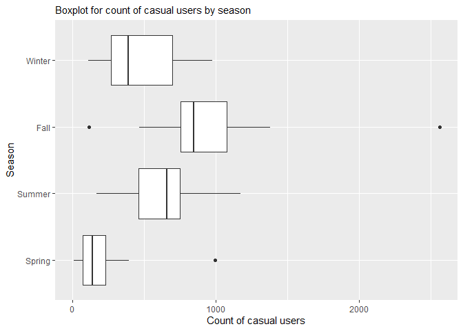
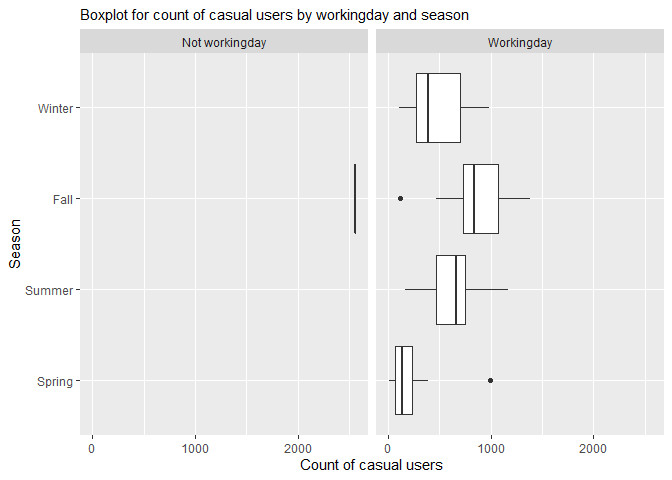
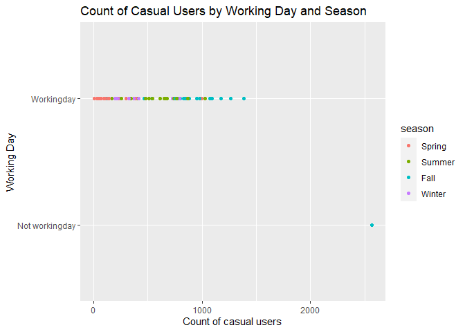
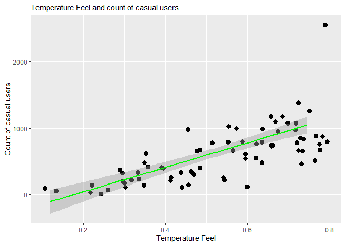
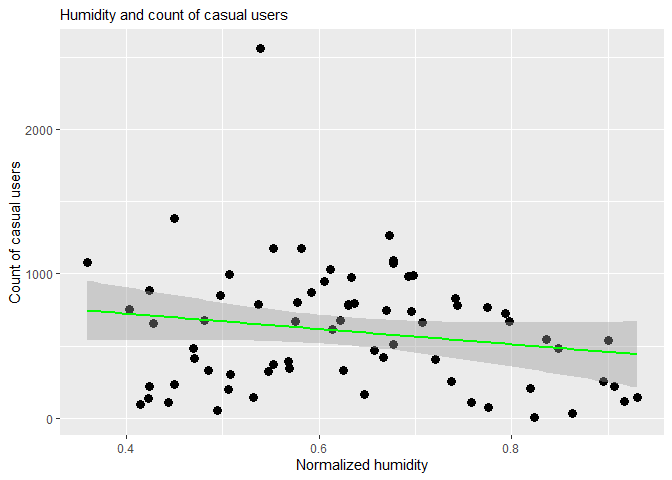
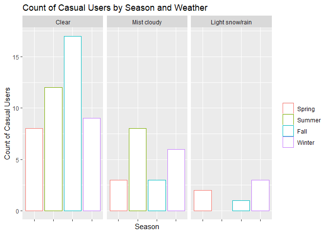
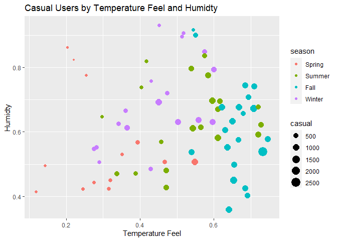

ST 558 Project 2
================
Yu Bai & Lee Pixton
7/11/2021

# Introduction

People are constantly finding new and innovative ways to help people get
around town, especially in large cities. One of these more recent
methods is through bike sharing. Through technology and smart phones,
the whole process of renting a bike, from membership, rental and return
has become automatic. These systems allow users to easily rent a bike
from a location nearby and return it back to another location, without
having to return to the pick up spot.  
The data we will be exploring contains the hourly and daily counts of
bike rentals between 2011 and 2012 in the Capital bikeshare system in
Washington, DC. We will be focused on predicting the number of casual
users, and be exploring the following variables:

-   `casual` - count of casual users
-   `season` - winter, spring, summer or fall
-   `workingday` - whether the day is a work day (not a holiday or
    weekend)
-   `weathersit` - weather situation (clear, misty, light precipitation,
    heavy precipitation)
-   `atemp` - Temperature feel in degrees Celsius
-   `hum` - humidity level

We will use both linear regression and ensemble learning methods to
predict the casual user count with the above variables.

## Packages

The packages that will be used in this analysis are below.

``` r
library(rmarkdown)
library(dplyr)
library(tidyverse)
library(knitr)
library(readr)
library(parallel)
library(MuMIn)
library(modelr)
library(caret)
library(formatR)
library(randomForest)
```

# Data

## Read csv data

First we read in the data from a csv file.

``` r
data <- read_csv(file = "./Bike-Sharing-Dataset/day.csv",
    col_names = TRUE)

# Select Monday
p2 <- data %>%
    filter(weekday == params$day)
```

## Split data into train data (70%) and test data (30%)

Next, we set the categorical variables to factors and create a test and
train set.

``` r
# Set categorical variables to factors
p2$season <- factor(p2$season, levels = c(1, 2, 3,
    4), labels = c("Spring", "Summer", "Fall", "Winter"))
p2$yr <- factor(p2$yr, levels = c(0, 1), labels = c("2011",
    "2012"))
p2$holiday <- factor(p2$holiday, levels = c(0, 1),
    labels = c("Not holiday", "Holiday"))
p2$weekday <- factor(p2$weekday, levels = c(0, 1, 2,
    3, 4, 5, 6), labels = c("Sunday", "Monday", "Tuesday",
    "Wednesday", "Thursday", "Friday", "Saturday"))
p2$workingday <- factor(p2$workingday, levels = c(0,
    1), labels = c("Not workingday", "Workingday"))
p2$weathersit <- factor(p2$weathersit, levels = c(1,
    2, 3, 4), labels = c("Clear", "Mist cloudy", "Light snow/rain",
    "Heavy rain/snow"))
p2$mnth <- factor(p2$mnth)

# Create train and test sets
train <- sample(1:nrow(p2), size = nrow(p2) * 0.7)
test <- dplyr::setdiff(1:nrow(p2), train)
p2Train <- p2[train, ]
p2Test <- p2[test, ]
```

## Summarizations

After reading in the data, we can now examine our training dataset. As
mentioned above, we will be specifically looking at the casual users of
bike sharing in this analysis.

### Casual Users by Season

The table below shows the distribution of casual users across four
seasons. It helps us see a season effect.

``` r
### count of casual users by season
s1 <- p2Train %>%
    group_by(season) %>%
    summarize(avg_casual = mean(casual, na.rm = TRUE),
        sd_casual = sd(casual, na.rm = TRUE), min_casual = min(casual,
            na.rm = TRUE), max_casual = max(casual,
            na.rm = TRUE))

kable(s1)
```

| season | avg\_casual | sd\_casual | min\_casual | max\_casual |
|:-------|------------:|-----------:|------------:|------------:|
| Spring |    215.0769 |   259.8924 |           9 |         997 |
| Summer |    626.6500 |   270.6955 |         168 |        1173 |
| Fall   |    937.9524 |   468.3022 |         118 |        2562 |
| Winter |    459.7778 |   259.0404 |         112 |         979 |

The box-plot displays the minimum, maximum, first quartile, third
quartile, median and outliers for casual users across seasons. It helps
us see difference in casual users over seasons.

``` r
# Boxplot for count of casual users by season
g1 <- ggplot(data = p2Train, aes(x = casual, y = season))
g1 + geom_boxplot() + labs(subtitle = "Boxplot for count of casual users by season",
    x = "Count of casual users", y = "Season") + guides(fill = guide_legend(title = NULL))
```

<!-- -->

The table below shows the distribution of casual users in workingday and
non-workingday across four seasons. It helps us see an interaction of
season and workingday effect.

``` r
### count of casual users by workingday and
### season
s4 <- p2Train %>%
    group_by(season, workingday) %>%
    summarize(avg_casual = mean(casual, na.rm = TRUE),
        sd_casual = sd(casual, na.rm = TRUE), min_casual = min(casual,
            na.rm = TRUE), max_casual = max(casual,
            na.rm = TRUE))
kable(s4)
```

| season | workingday     | avg\_casual | sd\_casual | min\_casual | max\_casual |
|:-------|:---------------|------------:|-----------:|------------:|------------:|
| Spring | Workingday     |    215.0769 |   259.8924 |           9 |         997 |
| Summer | Workingday     |    626.6500 |   270.6955 |         168 |        1173 |
| Fall   | Not workingday |   2562.0000 |         NA |        2562 |        2562 |
| Fall   | Workingday     |    856.7500 |   291.7039 |         118 |        1383 |
| Winter | Workingday     |    459.7778 |   259.0404 |         112 |         979 |

The graph below shows the distribution of casual users in workingday and
non-workingday across four seasons. It helps us compare the casual users
by workingday over four seasons.

``` r
# Barplot for count of casual users by workingday
# and season
g <- ggplot(data = p2Train, aes(x = casual, y = season))
g + geom_boxplot() + labs(subtitle = "Boxplot for count of casual users by workingday and season",
    x = "Count of casual users", y = "Season") + guides(fill = guide_legend(title = NULL)) +
    facet_wrap(~workingday)
```

<!-- -->

Here is another way to compare the count of casual users in workingday
and non-workingday across four seasons. It helps us understand the
difference in the casual users by workingday over four seasons.

``` r
# Scatterplot for casual by workingday and season
g1 <- ggplot(data = p2Train, aes(x = casual, y = workingday,
    group = season))
g1 + geom_point(aes(color = season)) + labs(title = "Count of Casual Users by Working Day and Season",
    x = "Count of casual users", y = "Working Day")
```

<!-- -->

### Casual Users by Temperature

The graph below shows the relationship between the count of casual users
and temperature. It helps us understand whether there is a linear
association between the two variables.

``` r
# Graph: temperature feel and count of casual
# users

g4 <- ggplot(data = p2Train, aes(x = atemp, y = casual))
g4 + geom_point(aes(x = temp, y = casual), size = 3) +
    geom_smooth(data = p2Train, formula = y ~ x, method = lm,
        col = "Green") + labs(subtitle = "Temperature Feel and count of casual users",
    x = "Temperature Feel", y = "Count of casual users") +
    guides(fill = guide_legend(title = NULL))
```

<!-- -->

### Casual Users by Humidity

The graph below shows the relationship between the count of casual users
and humidity. It helps us understand whether there is a linear
association between the two variables.

``` r
# Graph: humidity and count of casual users

g5 <- ggplot(data = p2Train, aes(x = hum, y = casual))
g5 + geom_point(aes(x = hum, y = casual), size = 3) +
    geom_smooth(data = p2Train, formula = y ~ x, method = lm,
        col = "Green") + labs(subtitle = "Humidity and count of casual users",
    x = "Normalized humidity", y = "Count of casual users") +
    guides(fill = guide_legend(title = NULL))
```

<!-- -->

### Weather Situations by Season

The table below shows the weather status over seasons.

``` r
### contingency table
table(p2Train$season, p2Train$weathersit)
```

    ##         
    ##          Clear Mist cloudy Light snow/rain Heavy rain/snow
    ##   Spring     8           3               2               0
    ##   Summer    12           8               0               0
    ##   Fall      17           3               1               0
    ##   Winter     9           6               3               0

### Casual Users by Weather Situation

The table below shows the distribution of the count of casual users over
three weather situations. It helps us understand the weather effect.

``` r
### count of casual users by Weather Situation
s6 <- p2Train %>%
    group_by(weathersit) %>%
    summarize(avg = mean(casual, na.rm = TRUE), sd = sd(casual,
        na.rm = TRUE), min = min(casual, na.rm = TRUE),
        max = max(casual, na.rm = TRUE))
kable(s6)
```

| weathersit      |   avg |        sd | min |  max |
|:----------------|------:|----------:|----:|-----:|
| Clear           | 739.5 | 417.96160 | 109 | 2562 |
| Mist cloudy     | 425.4 | 297.44286 |  53 | 1263 |
| Light snow/rain | 129.5 |  97.12827 |   9 |  254 |

### Casual Users by Weather Situations and Seasons

The graph below shows the count of casual users over seasons by three
weather situations. It helps us understand whether there is an
interaction between weather and season.

``` r
# Count of casual users by weather and season
g2 <- ggplot(p2Train, aes(x = season))
g2 + geom_bar(aes(fill = casual, position = "dodge",
    color = season), fill = "white") + labs(title = "Count of Casual Users by Season and Weather",
    y = "Count of Casual Users", x = "Season") + theme(legend.title = element_blank(),
    axis.text.x = element_blank()) + facet_wrap(p2Train$weathersit)
```

<!-- -->

### Casual Users by Humidity, Temperature, Weather Situations and Seasons

The graph below shows the effects of humidity and temperature on the
count of casual users over seasons. It helps us understand how multiple
variables affect casual users.

``` r
# Graph: humidity and count of casual users

g3 <- ggplot(p2Train, aes(x = atemp, y = hum))
g3 + geom_point(aes(size = casual, color = season)) +
    labs(title = "Casual Users by Temperature Feel and Humidty",
        x = "Temperature Feel", y = "Humidty") + guides(fill = guide_legend(title = NULL))
```

<!-- -->

## Modeling

Linear regression is used to estimate the association between a response
variable and one or more predictors by using a linear approach. Four
models are built for the analysis. The first one is a linear model,
which includes 5 predictors (`season`, `workingday`, `weathersit`,
`atemp`, `hum`). The second one is a random forest model. The third one
is once again a linear model, which includes only 4 predictors
(`season`, `workingday`, `weathersit`, `atemp`), removing the `hum`
variable. The fourth model is a boosted tree model.

``` r
# Model 1: Linear model with all 5 predictor
# variables
f_m1 <- as.formula("casual~season+workingday+weathersit+atemp+hum")

fit_m1 <- train(f_m1, data = p2Train, method = "lm",
    preProcess = c("center", "scale"), trControl = trainControl(method = "cv",
        number = 10))

summary(fit_m1)
```

    ## 
    ## Call:
    ## lm(formula = .outcome ~ ., data = dat)
    ## 
    ## Residuals:
    ##     Min      1Q  Median      3Q     Max 
    ## -298.68 -120.85  -29.33  122.63  464.77 
    ## 
    ## Coefficients: (1 not defined because of singularities)
    ##                             Estimate Std. Error t value Pr(>|t|)    
    ## (Intercept)                   601.42      23.61  25.477  < 2e-16 ***
    ## seasonSummer                   46.47      41.91   1.109  0.27172    
    ## seasonFall                     71.76      50.53   1.420  0.16051    
    ## seasonWinter                   43.24      36.51   1.184  0.24070    
    ## workingdayWorkingday         -183.13      24.38  -7.510 2.57e-10 ***
    ## `weathersitMist cloudy`       -72.41      30.56  -2.369  0.02090 *  
    ## `weathersitLight snow/rain`   -95.98      36.13  -2.657  0.00998 ** 
    ## `weathersitHeavy rain/snow`       NA         NA      NA       NA    
    ## atemp                         202.05      41.34   4.888 7.36e-06 ***
    ## hum                           -19.96      38.18  -0.523  0.60290    
    ## ---
    ## Signif. codes:  0 '***' 0.001 '**' 0.01 '*' 0.05 '.' 0.1 ' ' 1
    ## 
    ## Residual standard error: 200.3 on 63 degrees of freedom
    ## Multiple R-squared:  0.7965, Adjusted R-squared:  0.7707 
    ## F-statistic: 30.83 on 8 and 63 DF,  p-value: < 2.2e-16

Random forests are a learning approach for classification and regression
problems to build a predictive model. This model is made of many
decision trees.

``` r
# Define trainControl
trctrl <- trainControl(method = "repeatedcv", number = 10,
    repeats = 3)

# Model 2: Ensemble tree model (Random forest)
fit_m2 <- train(f_m1, data = p2Train, method = "rf",
    trControl = trctrl, preProcess = c("center", "scale"),
    tuneGrid = data.frame(mtry = 1))

fit_m2
```

    ## Random Forest 
    ## 
    ## 72 samples
    ##  5 predictor
    ## 
    ## Pre-processing: centered (9), scaled (9) 
    ## Resampling: Cross-Validated (10 fold, repeated 3 times) 
    ## Summary of sample sizes: 64, 64, 64, 66, 64, 66, ... 
    ## Resampling results:
    ## 
    ##   RMSE      Rsquared   MAE     
    ##   312.6183  0.6285386  248.7386
    ## 
    ## Tuning parameter 'mtry' was held constant at a value of 1

Now we can fit the next linear model, removing the `hum` variable as it
was not significant in the earlier model.

``` r
# Model 3: Linear model after dropping humidity
# from the first model
fit_m3 <- train(casual ~ season + workingday + weathersit +
    atemp, data = p2Train, method = "lm", preProcess = c("center",
    "scale"), trControl = trainControl(method = "cv",
    number = 10))

summary(fit_m3)
```

    ## 
    ## Call:
    ## lm(formula = .outcome ~ ., data = dat)
    ## 
    ## Residuals:
    ##     Min      1Q  Median      3Q     Max 
    ## -291.89 -125.27  -36.39  125.85  477.93 
    ## 
    ## Coefficients: (1 not defined because of singularities)
    ##                             Estimate Std. Error t value Pr(>|t|)    
    ## (Intercept)                   601.42      23.47  25.623  < 2e-16 ***
    ## seasonSummer                   44.30      41.47   1.068  0.28943    
    ## seasonFall                     72.48      50.22   1.443  0.15385    
    ## seasonWinter                   39.23      35.49   1.105  0.27318    
    ## workingdayWorkingday         -184.18      24.16  -7.622 1.49e-10 ***
    ## `weathersitMist cloudy`       -81.33      25.22  -3.224  0.00199 ** 
    ## `weathersitLight snow/rain`  -109.52      25.04  -4.373 4.60e-05 ***
    ## `weathersitHeavy rain/snow`       NA         NA      NA       NA    
    ## atemp                         194.55      38.55   5.047 3.97e-06 ***
    ## ---
    ## Signif. codes:  0 '***' 0.001 '**' 0.01 '*' 0.05 '.' 0.1 ' ' 1
    ## 
    ## Residual standard error: 199.2 on 64 degrees of freedom
    ## Multiple R-squared:  0.7956, Adjusted R-squared:  0.7733 
    ## F-statistic:  35.6 on 7 and 64 DF,  p-value: < 2.2e-16

Boosting tree models is a general approach that consists of growing the
trees sequentially. This means that each tree is based off of the
previous one, and predictions are updated along the way. In essence, we
are using several weaker tree models sequentially in order to create a
strong tree model. The errors of previous models are minimized and the
next model is then “boosted” to ideally improve the accuracy of
predictions and reduce error. Here we will use all five of our variables
of interest.

``` r
# Model 4: Ensemble tree model (boosted tree)
gbmGrid <- expand.grid(interaction.depth = 4, n.trees = 1000,
    shrinkage = 0.1, n.minobsinnode = 2)

fit_m4 <- train(casual ~ season + workingday + weathersit +
    atemp + hum, data = p2Train, method = "gbm", trControl = trctrl,
    preProcess = c("center", "scale"), verbose = FALSE,
    tuneGrid = gbmGrid)

fit_m4
```

    ## Stochastic Gradient Boosting 
    ## 
    ## 72 samples
    ##  5 predictor
    ## 
    ## Pre-processing: centered (9), scaled (9) 
    ## Resampling: Cross-Validated (10 fold, repeated 3 times) 
    ## Summary of sample sizes: 66, 65, 64, 64, 65, 65, ... 
    ## Resampling results:
    ## 
    ##   RMSE      Rsquared   MAE     
    ##   316.9584  0.5813271  220.0892
    ## 
    ## Tuning parameter 'n.trees' was held constant at a value of 1000
    ## Tuning
    ##  parameter 'shrinkage' was held constant at a value of 0.1
    ## Tuning
    ##  parameter 'n.minobsinnode' was held constant at a value of 2

## Model Comparison

After fitting the models, we can now compare them using multiple
methods. We will display each model’s RMSE, R-squared, and MAE below.

``` r
result <- as.matrix(t(data.frame(RMSE = c(fit_m1$results[[2]],
    fit_m2$results[[2]], fit_m3$results[[2]], fit_m4$results[[5]]),
    Rsquared = c(fit_m1$results[[3]], fit_m2$results[[3]],
        fit_m3$results[[3]], fit_m4$results[[6]]),
    MAE = c(fit_m1$results[[4]], fit_m2$results[[4]],
        fit_m3$results[[4]], fit_m4$results[[7]]))))

colnames(result) <- c("Model1", "Model2", "Model3",
    "Model4")

kable(result)
```

|          |      Model1 |      Model2 |      Model3 |      Model4 |
|:---------|------------:|------------:|------------:|------------:|
| RMSE     | 248.8481775 | 312.6183287 | 253.9909988 | 316.9584123 |
| Rsquared |   0.7071454 |   0.6285386 |   0.6958395 |   0.5813271 |
| MAE      | 191.7506561 | 248.7385826 | 196.8016465 | 220.0891853 |

## Model selection

Now we can select a best model fit for this data.

``` r
RMSE_min <- min(fit_m1$results[[2]], fit_m2$results[[2]],
    fit_m3$results[[2]], fit_m4$results[[5]])

if (fit_m1$results[[2]] == RMSE_min) {
    model <- 1
} else if (fit_m2$results[[2]] == RMSE_min) {
    model <- 2
} else if (fit_m3$results[[2]] == RMSE_min) {
    model <- 3
} else if (fit_m4$results[[5]] == RMSE_min) {
    model <- 4
}
```

The best model we will use is the one with smallest RMSE. Based on the
table above, the best model is Model 1
